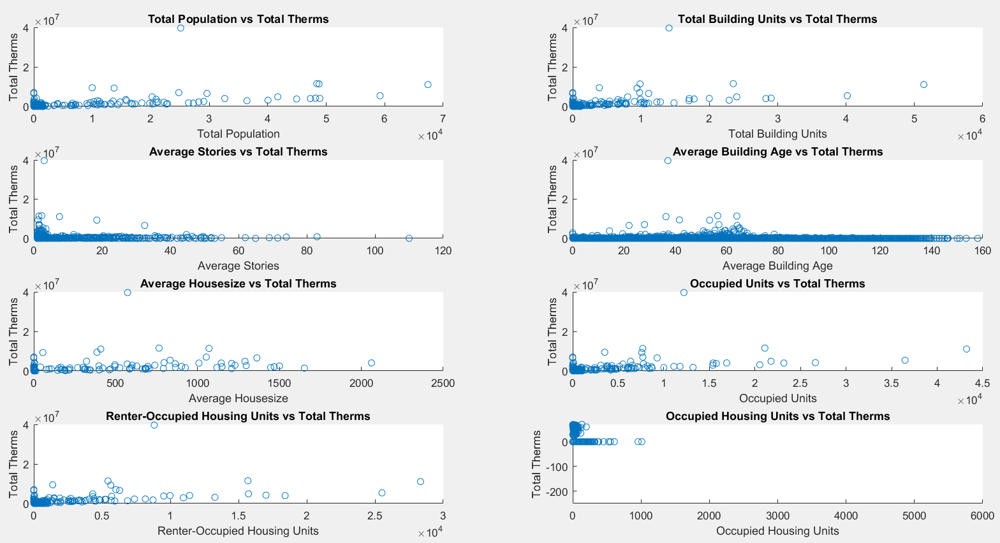
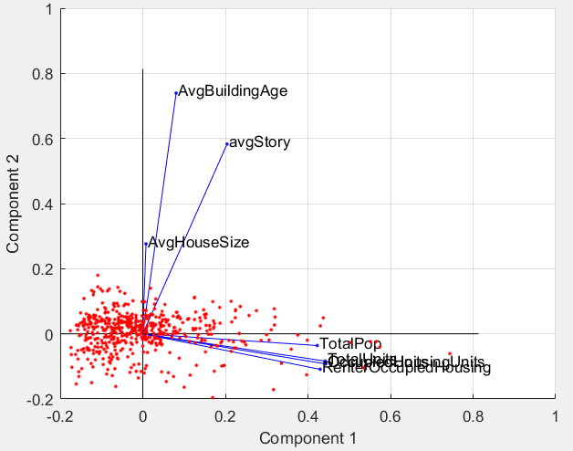
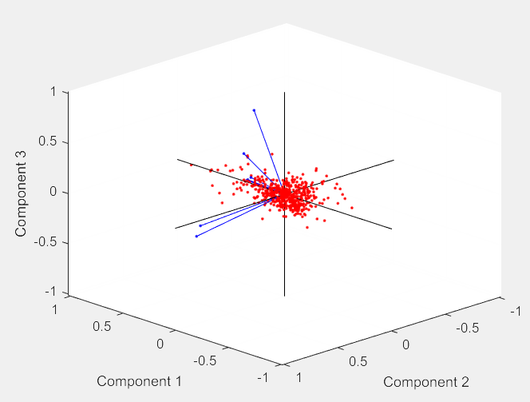
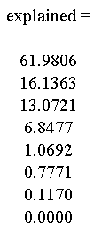
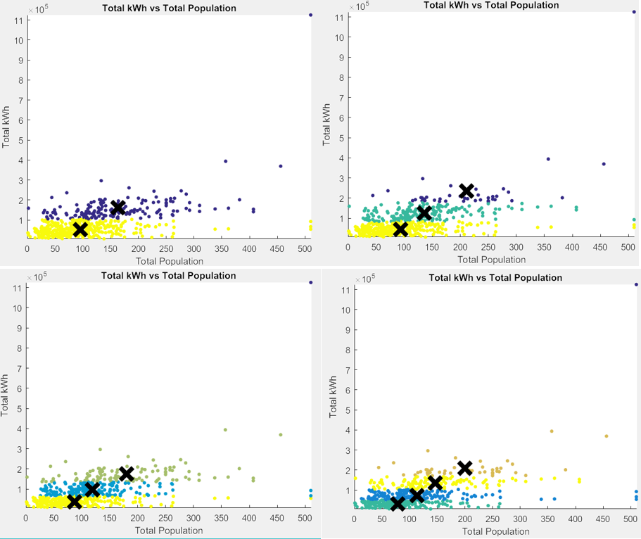

<h1>How to Run Chicago Energy Dataset Analysis</h1>

## Initializing Dataset Steps:
&nbsp;&nbsp;&nbsp;&nbsp;Run **Q0InitializationFile.m** to load all the datasets into the Matlab workspace.
 
## Execution Process
&nbsp;&nbsp;&nbsp;&nbsp;Below are questions posed, method utilized to answer, and files containing code that answered the question.
  
&nbsp;&nbsp;&nbsp;&nbsp;Run each of the files to display answers for the question.

## Questions For Dataset:
**Q1 - What factors best predict total heat and energy consumed? What expected energy consumption levels do these factors predict at large values?**
 
Linear Regression
 
&nbsp;&nbsp;&nbsp;&nbsp;Q1LinearRegression.m

_Figure 1: Linear Regression on Total kWh based on various inputs._

_Figure 2: Linear Regression on Total Therms based on various inputs._

**A1 -** Utilizing these plots and a covariance matrix, the input variables that best represent the output for both total kWh and total therms are total poplation and total building units.

**Q2 - Are the input factors redundant?**
 
PCA
 
&nbsp;&nbsp;&nbsp;&nbsp;Q2MatlabPCA.m

_Figure 3: PCA of 8 inputs graphed onto 2 Principal Components._

_Figure 4: PCA of 8 inputs graphed onto 3 Principal Components._

_Figure 5: How much each principal component explains the data._

**A2 -** PC1 explains 62.0% of the data and PC2 explains 16.1% of the data for a combined 78.1% of the data. PC3  explains about the same about as PC2 and adding it into the analysis explains approximately 91.2% of the data.

The analysis started with 8-dimensions of data. However, 1 dimension is almost useless (0-weight) and most of the data can be explained from the first 3 dimensions.
 	
A graph in 3-dimensions was attempted since the top 3 PCs explain most of the variance. Unfortunately, the vectors did not display the labels of each input variable.

**Q3 - Are there distinct clusters or groups to distinguish from the data?**
 
K-Means
 
&nbsp;&nbsp;&nbsp;&nbsp;Q3MasterKMeans.m

_Figure 6: (2-5 K-Means) Top left: 2 K-Means, Top right: 3 K-Means, Bottom left: 4 K-Means, Bottom right 5 K-Means_

**A3 -** From using k-means clustering, there seems to be no natural clusters between the average building age and the output total kWh. The clusters identified were vertically separated by thermal (heat) usage. Likewise, clustering by total population and total therms usage revealed similar vertical clustering. This clustering pattern can possibly represent the quality of building insulation. For example, higher Therms usage may represent poor insulation, and may result in an increase of the air conditioner or heater usage. 

## Possible future directions
During the course of this project, there were different features associated with the different total kWh and Therms usage. Could higher Therms or kWh usage have any correlation with the season? For example, if the temperature was hotter or colder, the Therms or kWh usage may increase. Data of the recorded average monthly temperature in Chicago in 2010 could be taken and a linear regression analysis could be performed and compared with this data.

## Contributing
1. Fork it!
2. Create your feature branch: `git checkout -b my-new-feature`
3. Commit your changes: `git commit -am 'Add some feature'`
4. Push to the branch: `git push origin my-new-feature`
5. Submit a pull request :D

[//]: # ()
