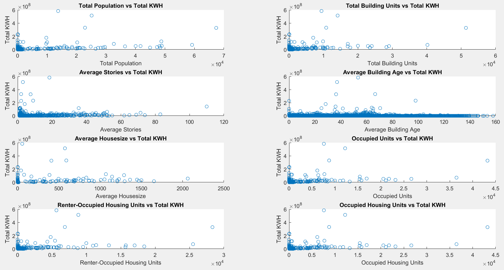

<h1>How to Run Chicago Energy Dataset Analysis</h1>

## Initializing Dataset Steps:
 
&nbsp;&nbsp;&nbsp;&nbsp;Run **InitializationFile.m** to load all the datasets into the Matlab workspace.
 
## Execution Process
 
&nbsp;&nbsp;&nbsp;&nbsp;Below are questions posed, method utilized to answer, and files containing code that answered the question.
 
&nbsp;&nbsp;&nbsp;&nbsp;Run each of the files to display answers for the question.

**Q1 - What factors best predict total heat and energy consumed? What expected energy consumption levels do these factors predict at large values?**
 
Linear Regression
 
&nbsp;&nbsp;&nbsp;&nbsp;Q1LinearRegression.m

**Q2 - Are the input factors redundant?**
 
PCA
 
&nbsp;&nbsp;&nbsp;&nbsp;Q2MatlabPCA.m

**Q3 - Are there distinct clusters or groups to distinguish from the data?**
 
K-Means
 
&nbsp;&nbsp;&nbsp;&nbsp;Q3MasterKMeans.m

## Contributing
1. Fork it!
2. Create your feature branch: `git checkout -b my-new-feature`
3. Commit your changes: `git commit -am 'Add some feature'`
4. Push to the branch: `git push origin my-new-feature`
5. Submit a pull request :D

